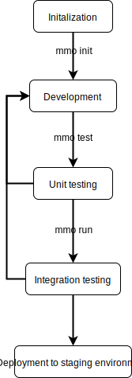

# Microservice Orchestrator Initial Proposal
The ability to orchestrate a microservice project easily  is really important. This comes from experience of spending a lot of time building, testing, deploying and maintaining middle-sized (5-10 microservices) projects.

This project focuses on solving issues stated above. However, there is one main feature that needs to be present all the time: ability to upgrade to new versions. This feature is particularly needed in our environment, where new projects come approx every 2 weeks. It is very important to be able to orchestrate or upgrade every project to the newest version of the microservice orchestrator without major conflicts or interference.

Vision: orchestrate microservice monorepo projects with ease

Main features (all in Go)
1. Generating project code
    1. New Project
    2. New Microservice
    3. New models, controllers, etc.
    4. gRPC rest gateways
    5. WebRPC server wrapper
2. Development environment
    1. Allow easily running single (or all) microservice
    2. Allow simple testing of each microservice
    3. Allow integration testing using kube configs (via minikube)
    4. Allow using vet, fmt or other tools automatically
3. Continuous integration and deployment
    1. Allow running the CI pipeline locally
    2. Make use of Dockerfiles and composes wherever we can

All of these features should make use of pre-built container images. These images will help to stabilize the orchestrator for more versions and simply upgrade whatever is needed.

Design

The application should be easily extendable CLI tool written in Go that relies heavily on Docker container system. This will allow us to build images that will provide feature sets such as gRPC extensions, CI integrations or third party modules that won’t be built into the tool.

The CLI should provide a stable API from the start (at least for core features). This is the initial proposal for the API.

Orchestration commands:

**mmo set-context {…name}** - sets context to the microservice(s) within the project, all further commands will be executed above this microservice(s). Defaults to “global”, which means everything will be executed for all services

**mmo dev** - starts the development mode in the current context. The development mode starts automated tests using goconvey and boostraps the infrastructure

**mmo build** - builds services within the context and prepares them for deployment

**mmo integration** - builds all the services, deploys them to the kubernetes development cluster (defaults to minikube) and starts up the integration tests. This command may take longer to execute as it involves deploying everything to the local cluster. The cluster is cleared afterwards.

**mmo run** - builds all microservices and applies configurations and infrastructure configurations to the target cluster

Code generation commands:

**mmo init {name}** - creates a new project with specified name, if no name is provided, it returns information about the current project. The project folder should be initialized with readme, glide, infra folder, contributing and issue template, mmo.json file (describing the project, see below), wercker.yml, and gitignore

**mmo proto regen** - regenerate proto files for the given services (in context)

**mmo add service {name}** - creates a new service within the project, adds Dockerfile and docker-compose, docs, models and infra folders with initialized readmes, example model and kube configs. Also generates proto files and imports necessary files (gorm models, google models, etc.)

**mmo add model {name}** - generates model with a given name, adding it to the protofiles

**mmo add plugin {name}** - adds plugin to the current service (such as database, cache, or other software that needs only docker image to run)

## Usage of the MMO in development cycle 

## Detailed description of MMO commands
### run
Command `run` can work in two modes:
1. Normal mode - project is built and deployed to local cluster
2. Watching mode - project is built and deployed to local cluster, then services are watched and redeployed when change in source files occures

Local cluster is instance of kubernetes running locally using  [minikube tool](https://github.com/kubernetes/minikube)

Build process:
Source code is built to binary file in Docker container to use particular version of the compiler. Binary is then used to build Docker image of application's service. Docker image will be pushed to Docker registry running in local cluster.

Deploy process:
Each of the services has own Helm chart that is used for deploying service. Helm chart can contains dependencies that services need such as database. Helm configuration file `values.yml` is created to provide needed informations to service - e.g. hostnames of the dependencies, usernames, passwords. Then, Helm chart of the each of the services is deployed to local cluster.

When services are deployed, we have to make them accessible using reverse proxy server in case running services are http servers. For example we can use Nginx http server configured as reverse proxy that will be dynamically configured when services will be deployed to the cluster.

## Plugin system
MMO plugin is Docker image with multiple binaries that act as an action hooks. MMO plugin extends basic functionality of the MMO.

### Action hooks
Are run at different stages of the project development. Hooks are stored in plugin's image in folder `/hooks`. Each of the hooks is binary file that has variable number of arguments that are services for which is plugin run (MMO context). 
List of hooks:
* Init hook (/hooks/init)
* Pre-build hook (/hooks/prebuild)
* Post-build hook (/hooks/postbuild)
* Pre-deploy hook (/hooks/predeploy)
* Post-deploy hook (/hooks/postbuild)

### Access to source code
Application's source code is mounted to `/source` of the plugin's image

### Plugin lifecycle
Docker image of the plugin is run as container and corresponding hook is run. When container exits its status code is returned to MMO